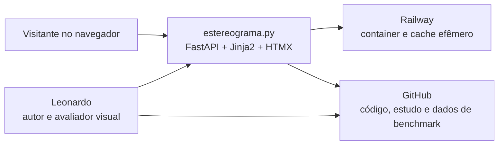
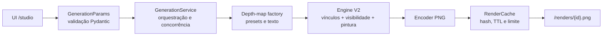
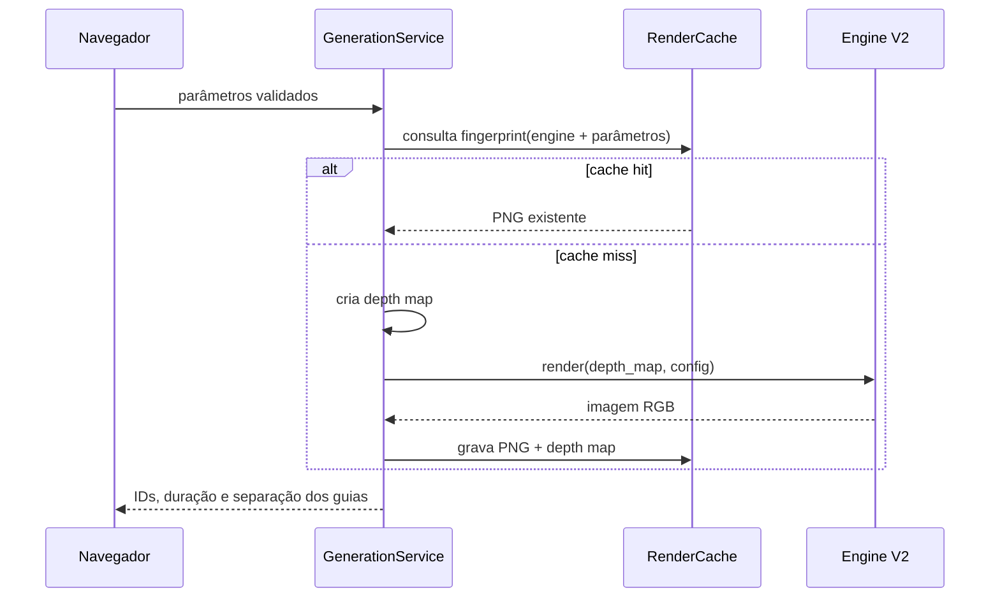

# Arquitetura — estereograma.py

> Documento vivo da arquitetura do projeto. Atualizar a cada decisão estrutural.

---

## 1. Visão

**estereograma.py** é um portfólio online + ferramenta interativa, focado em
estereogramas (autostereograms / Magic Eye). Combina quatro facetas em um único
site:

| Faceta | Quem serve | Onde mora |
|---|---|---|
| Hero educativo | Leigos que nunca conseguiram "ver" um | `/` |
| Galeria autoral | Visitantes curiosos / recrutadores | `/galeria` |
| Playground interativo | Público geral lúdico | `/playground` |
| "Como funciona" | Curiosos técnicos | `/como-funciona` |

### Princípios

1. **Gerador é o coração.** Tudo se apoia no módulo `app/stereogram/`. Site
   sem gerador funcional é inútil.
2. **API Python ponta-a-ponta.** O produto e o contrato permanecem Python; um
   núcleo Cython interno acelera loops críticos sem expor uma segunda API.
3. **Sem banco no MVP.** Galeria é arquivos + YAML; redeploy a cada push.
4. **JS mínimo.** HTMX cobre toda interatividade do playground.
5. **Acessibilidade educativa.** Cada estereograma exibido tem revelação
   opcional da figura escondida — leigos não devem ficar de fora.

### 1.1 Contexto e limites



O produto público ensina, recebe parâmetros e entrega imagens. O repositório
guarda a explicação reproduzível de como a engine foi escolhida e medida; o
Railway não é fonte de verdade de renders ou resultados experimentais.

### 1.2 Componentes da geração



`GenerationService` é o limite entre produto e algoritmo. A V2 recebe uma
imagem de profundidade e configuração imutável, devolvendo uma imagem RGB sem
conhecer HTTP, cache ou Railway.

### 1.3 Fluxo de uma solicitação



---

## 2. Stack

| Camada | Tecnologia | Por quê |
|---|---|---|
| Backend web | **FastAPI** + **Uvicorn** | Async nativo, tipagem forte, devx excelente |
| Templates | **Jinja2** | Padrão, integra zero-config com FastAPI |
| Interatividade | **HTMX** local | Form → POST → swap, sem build step nem framework JS |
| Processamento de imagem | **NumPy** + **Pillow** + **Cython** | NumPy/Pillow preparam e finalizam; Cython acelera vínculos, pintura e visibilidade |
| Persistência | **YAML** em disco | Galeria estática, versionada no git |
| Estilo | CSS puro | Design system próprio, sem build step |
| Testes | **pytest** | Padrão |
| Lint | **ruff** | Rápido, substitui flake8 + isort + black |
| Deploy | **Railway** | Conta existente, Dockerfile e promoção por healthcheck |

### Versões mínimas

- Python ≥ 3.11 (uso de `Literal`, `|` em tipos, `Self`)
- NumPy ≥ 1.26
- Pillow ≥ 10.0
- FastAPI ≥ 0.110
- Cython ≥ 3.0 somente no build compilado

---

## 3. Estrutura de pastas

```
estereograma.py/
├── app/
│   ├── __init__.py
│   ├── main.py                 # composição FastAPI e dependências compartilhadas
│   ├── content_loader.py       # loader de Markdown/YAML → list[Artigo]
│   ├── models/
│   │   └── generation.py       # contrato validado da geração
│   ├── routes/
│   │   ├── studio.py           # Estúdio e compatibilidade legada
│   │   └── renders.py          # entrega dos PNGs temporários
│   ├── services/
│   │   ├── generation_service.py # orquestra depth map, gerador e cache
│   │   └── render_cache.py     # cache em disco com TTL e limite de tamanho
│   ├── stereogram/             # ★ NÚCLEO — gerador independente
│   │   ├── __init__.py
│   │   ├── __main__.py         # CLI: python -m app.stereogram
│   │   ├── generator.py        # motor legacy e API histórica
│   │   ├── generator_v2.py     # motor oficial do Estúdio
│   │   ├── patterns.py         # depth maps sintéticos (esfera, coração, texto)
│   │   └── presets.py          # catálogo de presets do playground
│   ├── content/
│   │   └── aprender/           # artigos em Markdown com frontmatter YAML
│   │       ├── o-que-sao.md    # ✅ completo (~1 000 palavras)
│   │       ├── historia.md     # 🚧 skeleton
│   │       ├── visao-binocular.md
│   │       ├── teoria.md
│   │       ├── calculo.md
│   │       └── algoritmo.md
│   ├── templates/              # Jinja2
│   │   ├── base.html           # layout global (header + footer 3 colunas)
│   │   ├── index.html          # home D1
│   │   ├── aprender_indice.html
│   │   ├── artigo.html
│   │   ├── galeria.html
│   │   ├── studio.html
│   │   └── partials/
│   │       └── resultado.html  # fragmento HTMX (imagem gerada)
│   └── static/
│       ├── css/
│       │   └── style.css       # design system completo (~550 linhas)
│       └── img/
│           ├── hero/           # PNGs gerados por scripts/gerar_hero.py
│           │   ├── coracao_estereo.png
│           │   ├── coracao_depth.png
│           │   ├── mini_estereo.png
│           │   └── mini_depth.png
│           ├── galeria/        # obras autorais (.png) + reveals (.gif)
│           └── presets/        # depth maps gerados por scripts/gerar_presets.py
├── scripts/
│   ├── gerar_presets.py        # gera depth maps de preset em static/img/presets/
│   └── gerar_hero.py           # gera os PNGs estáticos do hero em static/img/hero/
├── benchmarks/                 # coleta JSONL, schema e relatórios derivados
├── docs/
│   ├── ENGINE_STUDY.md         # teoria aplicada, hipóteses e evidências
│   └── adr/                    # decisões arquiteturais curtas
├── tests/
│   ├── __init__.py
│   └── test_generator.py
├── .github/
│   └── workflows/
│       └── ci.yml              # matrix 3.11+3.12, ruff + pytest
├── pyproject.toml
├── CHANGELOG.md
├── CONTRIBUTING.md
├── README.md
└── ARCHITECTURE.md             # este arquivo
```

### Convenções

- **Idioma:** código em português (nomes de funções, variáveis, docstrings).
  Exceções: termos técnicos consagrados (`shift`, `pattern_width`, `seed`).
- **Tipagem:** type hints obrigatórios em toda função pública. `from __future__
  import annotations` no topo dos módulos pra postergar avaliação.
- **Erros:** levantar `ValueError` com mensagem clara em PT-BR pra problemas
  de uso. Validar nos limites públicos, confiar nas funções internas.

---

## 4. Módulo gerador (`app/stereogram/`)

### 4.1 API pública

A API histórica permanece disponível para a CLI:

```python
def gerar_estereograma(
    depth_map: PIL.Image.Image,
    largura: int = 800,
    altura: int = 600,
    eye_separation: int = 200,
    mu: float = 0.333,
    textura: Literal[
        "pink_noise", "random_dots", "random_dots_bw", "colorido", "custom"
    ] = "pink_noise",
    textura_custom: PIL.Image.Image | None = None,
    seed: int | None = None,
) -> PIL.Image.Image
```

O Estúdio usa a V2:

```python
@dataclass(frozen=True)
class RenderConfigV2:
    width: int = 900
    height: int = 560
    eye_separation: int = 216
    depth: float = 0.26
    oversample: int = 3
    mosaic_cell: int = 2
    depth_blur: float = 0.65
    occlusion: Literal["conflicts", "visibility"] = "visibility"
    texture: Literal["organic", "color", "mono", "mosaic"] = "mosaic"
    seed: int = 24

def render_stereogram_v2(
    depth_map: PIL.Image.Image,
    config: RenderConfigV2,
) -> PIL.Image.Image: ...
```

`RenderConfigV2`, `render_stereogram_v2` e `ENGINE_VERSION_V2` formam o contrato
compatível deste ciclo. Não há `Engine` abstrata: uma interface criada antes de
uma segunda implementação real só esconderia diferenças importantes.

### 4.2 Algoritmos — legacy e V2

Referência canônica: *Displaying 3D Images: Algorithms for Single Image Random
Dot Stereograms*, IEEE Computer 27(10), 1994. Substitui o método ingênuo de
look-back, que sofre de "pattern ringing" (artefatos em torno de objetos).

**Fórmula de separação estereoscópica:**

```
sep(z) = round((1 - μ·z) · E / (2 - μ·z))
```

- `E` (eye_separation): distância entre os olhos em pixels (~180–240 em telas)
- `μ` (mu): fator de depth-of-field, tipicamente ≈ 1/3
- `z ∈ [0, 1]`: profundidade normalizada (1 = perto, 0 = longe)

Essa fórmula modela a geometria real do olhar — sem ela, o relevo parece um
"disco em profundidade" em vez de um objeto volumétrico.

**Algoritmo, linha por linha:**

```
para cada y:
    same[x] = x  para todo x   # cada pixel em sua própria classe
    para cada x da esquerda pra direita:
        sep = sep(z[y, x])
        left = x - sep // 2
        right = left + sep
        se 0 <= left e right < largura:
            # union via cadeia de same[]
            l = same[left]
            enquanto l != left e l != right:
                se l < right: left = l;  l = same[left]
                senão:        same[left] = right; left = right; l = same[left]
            same[left] = right

    # colore da direita pra esquerda
    para x = largura-1 .. 0:
        se same[x] == x:  saida[y, x] = textura[y, x]   # raiz da classe
        senão:            saida[y, x] = saida[y, same[x]]
```

**Por que funciona melhor que o look-back:**

- Pixels que devem ter a **mesma cor** são unidos numa estrutura tipo
  union-find, em vez de copiados em cadeia. Isso elimina o acúmulo de erros
  que gera as "franjas" típicas do look-back.
- A coloração right-to-left garante que cada classe inteira receba a cor da
  sua raiz consistentemente.
- A fórmula de separação não-linear preserva a percepção de **volume**, não
  só de profundidade chapada.

**Complexidade do legacy:** O(largura × altura × α), onde α é o tamanho médio
da cadeia em `same[]` (efetivamente quase constante com path compression). Em
Python puro, ~800×600 leva 2–4s; aceitável pro dev. Se virar gargalo no
playground, vetorizar parte da iteração ou compilar o núcleo.

Na V2, cada linha possui vínculos `look_left`/`look_right` bidirecionais. Uma
máscara de visibilidade remove pontos encobertos, conflitos preservam a
superfície mais próxima, e a pintura parte do centro para não favorecer um
sentido. O cálculo ocorre em largura virtual 3× e termina com downsampling
Lanczos. A fundamentação, as hipóteses e o método de comparação vivem em
[`docs/ENGINE_STUDY.md`](docs/ENGINE_STUDY.md).

`_core_v2.pyx` implementa os loops de vínculos, pintura e visibilidade quando o
build define `ESTEREOGRAMA_BUILD_CYTHON=1`. `generator_v2.py` detecta a extensão
e recua automaticamente para o caminho Python quando ela não existe ou quando
`ESTEREOGRAMA_V2_FORCE_PYTHON=1`. Os dois caminhos são pixel-idênticos e
compartilham `ENGINE_VERSION_V2 = "v2.0"`.

`/healthz` informa `engine_version` e `engine_implementation`. Isso mantém o
fallback automático, mas torna visível uma queda inesperada de `cython` para
`python` no ambiente publicado.

### 4.3 Texturas (`_gerar_textura` em generator.py)

| Tipo | Descrição | Quando usar |
|---|---|---|
| `pink_noise` (default) | Ruído 1/f via FFT, organicamente texturizado | Default — academicamente o melhor pra profundidade ([arXiv 1506.05036](https://arxiv.org/abs/1506.05036)) |
| `random_dots` | Ruído branco RGB | Clássico Magic Eye colorido |
| `random_dots_bw` | Ruído branco preto/branco binário | Alto contraste, lembra estilo Magic Eye book |
| `colorido` | Amostra de paleta de 6 cores saturadas | Visual mais "pop", mais ruidoso |
| `custom` | Imagem fornecida pelo usuário, redimensionada com Lanczos | Branding / temática |

### 4.4 Depth maps sintéticos (`patterns.py`)

Funções puras que retornam `PIL.Image.Image` em modo `L`:

- `esfera(largura, altura, raio)` — gradiente radial (sqrt para parecer esfera)
- `coracao(largura, altura)` — máscara via equação implícita
- `texto(palavra, largura, altura)` — texto em relevo (tenta Arial, fallback default)

Adicionar novos depth maps aqui mantém a base de presets crescível sem mexer no gerador.

### 4.5 CLI (`__main__.py`)

```bash
python -m app.stereogram <depth_map.png> <saida.png> \
    [--largura 800] [--altura 600] \
    [--eye-separation 200] [--mu 0.333] \
    [--textura pink_noise|random_dots|random_dots_bw|colorido|custom] \
    [--textura-custom path] [--seed 42]
```

Reusável em scripts e CI. Não depende do FastAPI.

---

## 5. Camada web

### 5.1 Rotas

| Rota | Método | Renderiza | Status |
|---|---|---|---|
| `/` | GET | `index.html` (hero D1) | ✅ |
| `/como-ver` | GET | `como_ver.html` (treino guiado em três passos) | ✅ |
| `/como-funciona` | GET | `como_funciona.html` (pipeline, fórmula e código) | ✅ |
| `/aprender` | GET | `aprender_indice.html` (lista de artigos) | ✅ |
| `/aprender/{slug}` | GET | `artigo.html` (artigo com prev/next) | ✅ |
| `/studio` | GET | `studio.html` (controles + preview) | ✅ |
| `/studio/preview` | POST | `partials/studio_result.html` (HTMX swap) | ✅ |
| `/renders/{id}.png` | GET | PNG temporário do resultado ou depth map | ✅ |
| `/playground` | GET | redirect permanente para `/studio` | ✅ |
| `/galeria` | GET | `galeria.html` (placeholder por ora) | ⏳ |
| `/galeria/{slug}` | GET | detalhe da obra | ⏳ |
| `/static/*` | GET | arquivos estáticos via `StaticFiles` | ✅ |

### 5.2 Design system (`app/static/css/v03.css`)

O CSS v0.3 estende a folha legada durante a migração das telas. A direção é um
laboratório óptico editorial: superfícies claras, grade fina, tipografia forte e
as cores expressivas concentradas no estereograma.

```css
:root {
    --ink: #11110f;
    --paper: #f2efe6;
    --surface-v03: #e8e4d9;
    --mist-v03: #d9d6cc;
    --lab-blue: #315cff;
    --signal-coral: #ff5a45;
    --white-v03: #fffdf7;
}
```

**Tipografia:** Instrument Sans variável para títulos e interface; IBM Plex Mono
para parâmetros e metadados. Os arquivos e licenças OFL ficam em
`app/static/fonts/`, sem dependência de Google Fonts em runtime.

**Motivos próprios:** dois pontos coral de alinhamento, marcas de registro,
divisórias editoriais e sombra sólida. Não há glow, gradiente de texto ou
animação contínua sobre a imagem.

**Reveal acessível:** checkbox visualmente oculto permanece navegável pelo
teclado; o sibling selector alterna o mapa de profundidade em 220 ms e mostra
foco azul explícito.

### 5.3 Conteúdo educativo (`app/content_loader.py`)

```python
@dataclass(frozen=True)
class Artigo:
    slug: str; titulo: str; ordem: int; resumo: str
    html: str; fontes: tuple[str, ...] = ()
```

- Arquivos `.md` em `app/content/aprender/` com frontmatter YAML (`titulo`, `ordem`,
  `resumo`, `fontes`).
- Extensões python-markdown: `fenced_code`, `tables`, `toc`, `footnotes`, `smarty`,
  `attr_list`, `sane_lists`.
- Lista carregada uma vez no startup e injetada globalmente nos templates:
  `templates.env.globals["artigos_global"] = ARTIGOS`.
- `vizinhos(artigos, slug)` devolve `(anterior, proximo)` para navegação prev/next.

### 5.4 Padrão HTMX no Estúdio

```html
<form hx-post="/studio/preview"
      hx-target="#resultado"
      hx-swap="innerHTML"
      hx-indicator="#carregando">
  <select name="preset">...</select>
  <select name="textura">...</select>
  <button>Gerar</button>
  <span id="carregando" class="htmx-indicator">gerando…</span>
</form>
<div id="resultado"></div>
```

O endpoint `/studio/preview` é uma rota síncrona, portanto o FastAPI executa o
trabalho CPU-bound fora do event loop. Ele devolve um fragmento Jinja com URLs
para o estereograma e o depth map. Os PNGs ficam num cache temporário em disco,
com hash determinístico, TTL de 30 minutos e limite total de 100 MB. Nenhum PNG
é embutido em base64 no HTML.

O HTMX 1.9.12 é versionado em `app/static/js/`; não há dependência de CDN em
runtime. Para uploads (Fase 4), a mesma rota aceitará `multipart/form-data` via
`UploadFile` do FastAPI.

`app/static/js/studio.js` mantém apenas o estado de interface: alterna Forma e
Texto, atualiza o rótulo da prévia, preserva o último resultado enquanto o HTMX
processa uma variação, mostra o fragmento de erro sem swap e monta o link
reproduzível. O backend continua sendo a fonte de verdade dos parâmetros.

Links de `/studio` aceitam `subject_type`, `subject`, `texture`, `depth`, `seed`
e `eye_separation`. A página restaura os controles, mas só gera depois de uma
ação explícita, evitando processamento CPU-bound em um GET compartilhado.

`app/static/js/como-ver.js` controla somente o passo ativo do tutorial, o painel
de ajuda e a conclusão. As instruções permanecem no HTML e a imagem de treino
usa o mesmo reveal acessível da Home; nenhuma etapa depende do backend.

`app/static/js/como-funciona.js` atualiza apenas o laboratório visual. O cálculo
de `sep(z)` replica a fórmula do núcleo para fins educativos com `E=200` e
`μ=0.333`; ele não gera imagens nem substitui o backend.

### 5.5 Gerenciamento da galeria

Estrutura de `app/static/galeria.yaml`:

```yaml
- slug: dinossauro-2026
  titulo: Dinossauro
  imagem: galeria/dinossauro.png
  figura_escondida: galeria/dinossauro_reveal.gif
  descricao: |
    Primeiro estereograma autoral, padrão random dots com depth map desenhado à mão.
  data: 2026-04-12
  tags: [random-dots, animal]
  parametros:
    pattern_width: 120
    profundidade_max: 0.4
    seed: 42
```

Carregado uma vez no startup do FastAPI (`@app.on_event("startup")` ou
lifespan handler), armazenado num módulo singleton. Recarrega a cada deploy.

Não há sistema de admin — adicionar obra = commit + push.

---

## 6. Estratégia de testes

### 6.1 Unit (atual)

`tests/test_generator.py` cobre:
- Dimensões e modo da imagem de saída
- Determinismo com `seed` fixa
- Diferenciação com seeds distintas
- Período de repetição em região plana de profundidade
- Validação de parâmetros (`pattern_width` mínimo, `textura=custom` sem imagem)

### 6.2 Integração (Fase 2+)

`TestClient` do FastAPI cobre:
- renderização e compatibilidade da rota antiga do Estúdio;
- erro de entrada inválida em fragmento amigável;
- POST `/studio/preview` retorna URLs, nunca base64;
- `GET /renders/{id}.png` entrega um PNG válido.

Os testes de serviço cobrem validação de texto e cache hit/miss determinístico.

`tests/test_stereogram_v2.py` congela a API pública e a configuração padrão.
`tests/test_benchmarks.py` verifica os seis goldens. No CI, a suíte roda com a
extensão Cython compilada e volta a rodar com `ESTEREOGRAMA_V2_FORCE_PYTHON=1`.
Os loops C liberam o GIL, e um teste concorrente exige que quatro renders
paralelos continuem produzindo pixels idênticos. O serviço mantém um semáforo de
duas gerações até que CPU e memória do ambiente publicado sejam medidas.

### 6.3 Validação manual visual

Não é automatizável: humano olha o PNG e confirma que vê o 3D. Rodar a cada
mudança não-trivial no algoritmo:

```bash
python -m app.stereogram app/static/img/presets/esfera.png /tmp/test.png --seed 42
```

---

## 7. Deploy

### 7.1 Alvo: Railway

Razões:
- conta e operação já usadas nos projetos Observatório da Educação e Sisyphus;
- build explícito pelo Dockerfile, sem depender da autodetecção do Railpack;
- `PORT` injetada pela plataforma e healthcheck antes da troca de tráfego;
- Project Tokens separados por ambiente para automação com privilégio mínimo.

### 7.2 Container e serviço

- `Dockerfile` multi-stage baseado em Python 3.12 slim: GCC/Cython existem só
  no builder; o runtime recebe a extensão pronta e roda sem compilador.
- Uvicorn em `0.0.0.0:8080`, um worker por causa do cache local efêmero.
- `railway.toml` define Dockerfile, `/healthz` e política de reinício.
- `/healthz` é consultado pelo container e pelo Railway antes da promoção.
- `PUBLIC_BASE_URL` define canonical, sitemap e URLs absolutas de Open Graph.
- PNGs gerados são efêmeros; não há volume persistente no lançamento.
- staging manual antecede qualquer habilitação do workflow de produção.

### 7.3 Variáveis de ambiente

- `PORT` — porta interna injetada pelo Railway
- `PUBLIC_BASE_URL` — origem pública sem barra final

---

## 8. Roadmap

### Fases do produto

| Fase | Entregável | Status |
|---|---|---|
| **F1** | Gerador standalone + CLI + presets + testes | ✅ |
| **F2** | FastAPI app + playground + hub educativo fundação | ✅ (falta deploy) |
| **F3** | Galeria via YAML + obras curadas + páginas de detalhe | ⏳ |
| **F4** | Upload de depth map no playground + rate limiting | ⏳ |
| **F5** | SEO, segurança e empacotamento para deploy | ✅ (aguarda staging no Railway) |
| **v0.3 · Fase 1** | contratos, Estúdio, cache e renders por URL | ✅ |
| **Engine V2 · CPU** | estudo, goldens, benchmark e otimização pura | ✅ (452–477 ms de mediana) |
| **Engine V2 · Cython** | núcleo compilado, fallback e matriz RGB | ✅ (59–62 ms de mediana no spike) |
| **Engine V2 · WebGL** | fork, coleta GPU e avaliação A/B | ⛔ rejeitada como preview após sessão cega |

### Iterações de design (D-series)

| Iteração | Escopo | Status |
|---|---|---|
| **D1** | Home — hero com estereograma, tutorial, 3 portas, design system dark-retro | ✅ |
| **D2** | `/aprender` — trilha visual, indicador de progresso, teasers dos artigos | ⏳ próxima |
| **D3** | Página de artigo — TOC sidebar fixo, drop cap, sidenotes, prev/next como cards | ⏳ |
| **D4** | Galeria — masonry, filter chips (era/estilo/licença), hover reveal | ⏳ |
| **D5** | Playground — 2 colunas, controles fixos à esquerda, auto-generate com debounce, compartilhamento por query string | ⏳ |
| **D6** | Polish global — microanimações, glow pulse no CTA, easter egg, card rotations sutis | ⏳ |

### Critérios de saída por fase

- **F1:** `pytest` passa + estereograma gerado e o 3D é visível
- **F2:** site online no Railway, Estúdio gera < 2s sem reload ← **pendente: staging**
- **F3:** ≥ 5 obras na galeria, navegação fluida, reveal funciona
- **F4:** upload de PNG cinza qualquer → estereograma; inválidos retornam erro amigável
- **F5:** Lighthouse mobile ≥ 85 em performance e acessibilidade

---

## 9. Decisões adiadas (com gatilho de revisão)

| Decisão | Padrão atual | Quando revisitar |
|---|---|---|
| Banco de dados | Nenhum (YAML) | Quando quiser editar galeria pela web |
| Sistema de contato | Nenhum (e-mail no rodapé) | Se receber spam por scrapping |
| i18n PT/EN | Só PT-BR | Quando primeiro acesso fora do Brasil |
| Domínio próprio | domínio Railway inicial | Quando o portfólio for divulgado publicamente |
| Núcleo compilado | Cython interno com fallback Python | Revisitar se build, compatibilidade ou pixels divergirem |
| Preview WebGL | Não adotado após A/B cego | Somente com nova hipótese perceptiva e novo protocolo aprovado |
| Extração da engine | Dentro de `app/stereogram/` | Depois de estabilizar API e estratégia de execução |
| Analytics | Nenhum | Após primeiro mês de tráfego real |

---

## 10. Riscos conhecidos

1. **Performance do gerador** em depth maps grandes (1920×1080+) — o custo
   continua crescendo com largura virtual, altura e alcance de visibilidade.
   Mitigação: limite explícito de dimensões, núcleo Cython e fallback testado.

2. **Uploads maliciosos** (Fase 4) — PIL tem CVEs históricos; PNGs gigantes
   podem causar OOM. Mitigação: validar dimensões e tamanho **antes** de
   abrir com PIL; usar `Image.MAX_IMAGE_PIXELS`.

3. **Cold start no free tier** — usuário pode esperar 5–10s no primeiro
   acesso. Mitigação aceitável pro estágio atual; revisitar se virar dor.

4. **Acessibilidade** — visitantes não enxergam o 3D. Mitigação: cada
   estereograma exibido tem a figura escondida revelável (GIF lado-a-lado
   ou overlay), garantida no design da galeria e do hero.

---

## 11. Como atualizar este documento

- Ao concluir uma fase, marcar com ✅ na tabela do §8.
- Ao tomar uma decisão arquitetural (mudar stack, adicionar dependência
  pesada, mudar deploy target), adicionar entrada com data no §9 ou §10.
- Nomes de arquivos novos no núcleo do gerador → atualizar §3 e §4.
