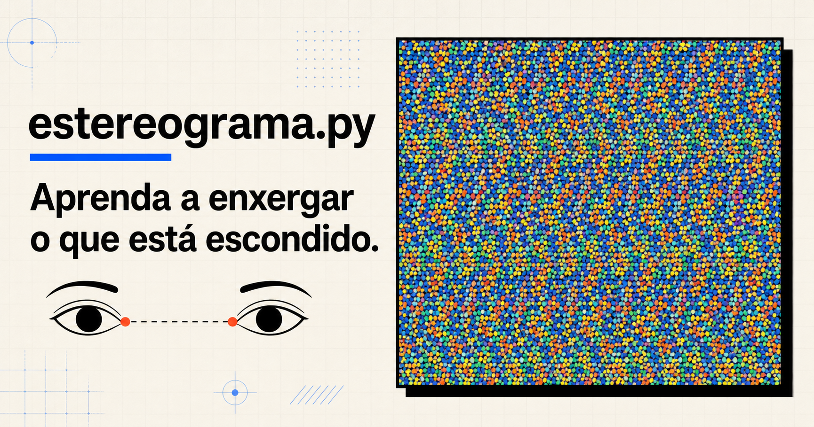
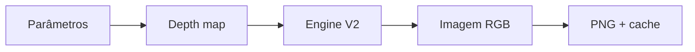

<p align="center">
  
</p>

<h1 align="center">estereograma.py</h1>

<p align="center">
  Laboratório óptico interativo para aprender, criar e investigar autostereogramas.
  <br>
  Sem cadastro, com geração reproduzível e uma engine autoral em Python.
</p>

<p align="center">
  <a href="https://estereograma-py-production.up.railway.app"><strong>Experimentar o site</strong></a>
  ·
  <a href="docs/ENGINE_STUDY.md">Estudo da engine</a>
  ·
  <a href="ARCHITECTURE.md">Arquitetura</a>
</p>

<p align="center">
  <a href="https://github.com/leonardo-michelotti/estereograma.py/actions/workflows/ci.yml"></a>
  
  <a href="LICENSE"></a>
  <a href="CONTENT_LICENSE.md"></a>
</p>

---

## Aprenda a enxergar o que está escondido

Um autostereograma parece uma textura repetida, mas carrega uma cena em
profundidade. O projeto transforma essa curiosidade em uma experiência completa:

| Experiência | O que acontece |
| --- | --- |
| **Home** | apresenta o fenômeno com uma obra real e sua revelação |
| **Como ver** | ensina visão paralela em três passos, com ajuda visual |
| **Como funciona** | conecta depth map, disparidade, fórmula e código |
| **Estúdio** | cria formas ou texto com textura, profundidade e seed reproduzível |

O fluxo foi desenhado como uma pequena jornada:

```text
alinhar o olhar  →  perceber o volume  →  criar  →  revelar  →  compartilhar
```

## O gerador é o produto

A V2 é uma implementação independente, escrita a partir da geometria publicada
por Thimbleby, Inglis e Witten. Para cada linha, a engine:

1. transforma a profundidade em separação binocular simétrica;
2. descarta vínculos escondidos por superfícies mais próximas;
3. resolve conflitos preservando a menor separação;
4. propaga as equivalências e aplica a textura;
5. renderiza em 3× e reduz com Lanczos para suavizar as bordas.



A configuração atual usa oclusão por visibilidade, mosaico de 2 px,
oversampling horizontal 3× e seed explícita. A versão da engine participa da
chave do cache, evitando misturar renders produzidos por algoritmos diferentes.

[Ler a implementação](app/stereogram/generator_v2.py) ·
[Entender as decisões](docs/ENGINE_STUDY.md) ·
[Consultar os ADRs](docs/adr/)

## Engenharia medida, não presumida

A otimização foi conduzida como um estudo reproduzível:

```text
teoria → hipótese → baseline → profiling → otimização → goldens → decisão
```

Benchmark oficial em 900 × 560, oversampling 3×, duas execuções de aquecimento
e dez medições aceitas com `CV ≤ 5%`:

| Caso | Baseline | V2 otimizada | Redução | p95 atual |
| --- | ---: | ---: | ---: | ---: |
| Coração | 1.223,94 ms | **477,46 ms** | **61,0%** | 488,09 ms |
| Texto 3D | 1.214,70 ms | **451,95 ms** | **62,8%** | 460,53 ms |
| Esfera | 1.124,82 ms | **472,92 ms** | **58,0%** | 494,72 ms |

A meta foi atingida em Python/NumPy puro; Numba e Cython não foram necessários.
Os seis resultados dourados permaneceram pixel a pixel idênticos.

### Experimento WebGL

Um [fork MIT separado](https://github.com/leonardo-michelotti/stereogram-webgl/tree/codex/engine-benchmark)
mede a alternativa GPU com os mesmos três depth maps, textura, resolução e faixa
de disparidade.

| Caso | Shader GPU | p95 | Exportação PNG | CV |
| --- | ---: | ---: | ---: | ---: |
| Coração | 0,78 ms | 0,80 ms | 27,20 ms | 1,41% |
| Texto 3D | 0,84 ms | 0,87 ms | 47,30 ms | 1,63% |
| Esfera | 0,76 ms | 0,78 ms | 20,60 ms | 1,35% |

O tempo de GPU mede apenas o shader sincronizado e não equivale à latência
end-to-end do servidor. O portão de performance passou; a adoção continua
pendente de duas sessões A/B cegas sobre fusão, profundidade e artefatos.

[Dados brutos](benchmarks/data/) ·
[Relatórios derivados](benchmarks/reports/) ·
[Metodologia completa](docs/ENGINE_STUDY.md)

## Arquitetura

O produto separa HTTP, orquestração, algoritmo e armazenamento temporário:

```text
Jinja2 + HTMX
      │
      ▼
FastAPI / contratos Pydantic
      │
      ▼
GenerationService ──► Depth-map factory
      │
      ▼
Engine V2 ──► RenderCache ──► /renders/{id}.png
```

- **FastAPI + Jinja2 + HTMX local** para a experiência web;
- **NumPy + Pillow** para depth maps, geração e PNG;
- **Pydantic** nos contratos da UI e dos benchmarks;
- **cache efêmero por fingerprint** com TTL e limite de tamanho;
- **Railway + Docker** para staging e produção;
- **pytest + Ruff** na matriz Python 3.11/3.12.

Não existe banco no MVP. A engine não conhece FastAPI, cache ou Railway e pode
ser estudada de forma isolada. Veja os diagramas e limites em
[`ARCHITECTURE.md`](ARCHITECTURE.md).

## Rodando localmente

Requer Python 3.11 ou mais recente.

```bash
git clone https://github.com/leonardo-michelotti/estereograma.py.git
cd estereograma.py
python -m venv .venv
```

Ative o ambiente:

```bash
# Windows
.venv\Scripts\activate

# Linux ou macOS
source .venv/bin/activate
```

Instale e execute:

```bash
pip install -e ".[dev]"
uvicorn app.main:app --reload
```

Acesse `http://127.0.0.1:8000`.

## Criando um estereograma

O caminho recomendado é o Estúdio em `/studio`. A CLI histórica permanece
disponível e usa o motor legacy:

```bash
python -m app.stereogram app/static/img/presets/esfera.png saida.png --seed 42
```

Para verificar a V2 e seus resultados dourados:

```bash
python -m benchmarks.goldens
python -m benchmarks.run --engine v2 --suite canonical --repeat 10 \
  --output <arquivo.jsonl>
python -m benchmarks.report <arquivo.jsonl> --output <relatorio.md>
```

## Qualidade

```bash
ruff check .
pytest
```

A suíte cobre contratos, cache, rotas, determinismo, compatibilidade da API,
oclusão e seis imagens douradas. Performance é registrada em ambiente
controlado, mas não bloqueia o CI compartilhado.

## Estado do projeto

| Parte | Estado |
| --- | --- |
| Experiência v0.3 | implementada e validada localmente |
| Engine V2 | integrada ao Estúdio; qualidade e performance aprovadas |
| Produção Railway | publicada; promoção da V2 exige novo staging autorizado |
| WebGL | experimento técnico; avaliação A/B em andamento |
| Upload de foto/depth map | próxima evolução de produto |

Nenhum deploy é disparado por alterações locais. O fluxo é
`CI → staging manual → validação → produção`, sempre com autorização explícita.

## Documentação

- [Estudo aplicado da engine](docs/ENGINE_STUDY.md)
- [Arquitetura e roadmap](ARCHITECTURE.md)
- [ADRs](docs/adr/)
- [Procedimento de deploy](docs/DEPLOY.md)
- [Changelog](CHANGELOG.md)
- [Como contribuir](CONTRIBUTING.md)

## Licenças e referências

- código sob [MIT](LICENSE);
- conteúdo educativo sob [CC BY-SA 4.0](CONTENT_LICENSE.md);
- H. W. Thimbleby, S. J. Inglis e I. H. Witten,
  [*Displaying 3D Images: Algorithms for Single-Image Random-Dot Stereograms*](https://hdl.handle.net/10289/47);
- W. A. Steer, [descrição técnica de estereogramas](https://www.techmind.org/stereo/stech.html).

A V2 foi escrita de forma independente a partir das descrições matemáticas. O
código GPL de projetos comparados não foi incorporado à implementação MIT.
