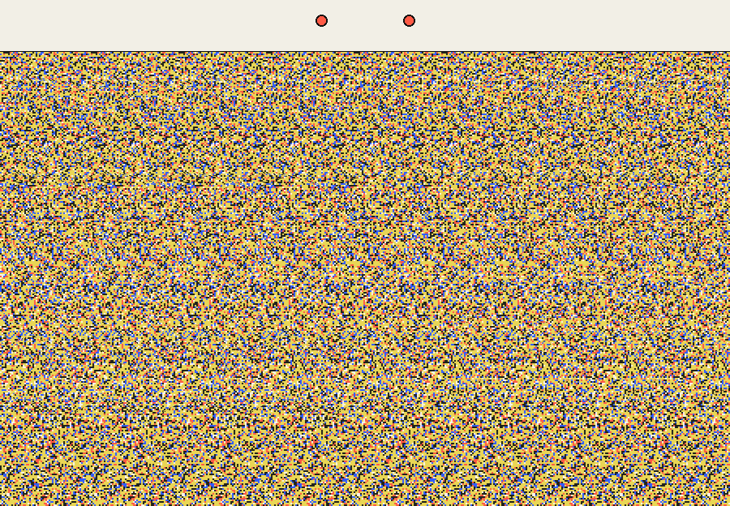

# estereograma.py

Este projeto começou com uma pergunta bem simples: dá para gerar um
estereograma com Python?

O primeiro script respondeu que sim. Só que, quanto mais eu mexia, mais o
problema mudava. Gerar uma textura repetida é fácil; gerar uma profundidade que
o olho encontra rápido não é. Foi aí que o projeto ficou interessante.

Hoje ele é meu laboratório para estudar visão, experimentar algoritmos e criar
estereogramas direto no navegador.

[Abrir o site](https://estereograma-py-production.up.railway.app) ·
[Criar um estereograma](https://estereograma-py-production.up.railway.app/studio) ·
[Ler o estudo da engine](docs/ENGINE_STUDY.md)

[](https://github.com/leonardo-michelotti/estereograma.py/actions/workflows/ci.yml)


## Primeiro, tente enxergar

Abra a imagem no tamanho real, relaxe o olhar e tente focar atrás da tela. Os
dois pontos vermelhos devem virar três. Quando isso acontecer, segure o ponto do
meio e deixe a imagem aparecer.

Tem um coração em duas camadas escondido aqui:

[](docs/assets/readme-estereograma.png)

<details>
  <summary>Não apareceu? Veja o que está escondido</summary>
  <p align="center">
    
  </p>
</details>

Se você estiver vendo a imagem reduzida, clique nela. Estereograma pequeno fica
mais difícil porque a distância entre as repetições também encolhe.

## O que existe no projeto

O site tem três caminhos:

- **Como ver:** um treino curto para quem nunca conseguiu enxergar um;
- **Estúdio:** criação de formas e textos com profundidade, textura e seed;
- **Como funciona:** a matemática e o código sem esconder a parte difícil.

Não tem cadastro nem banco. Você escolhe os parâmetros, a engine gera o PNG e o
resultado fica em um cache temporário para poder ser baixado ou compartilhado.

```text
parâmetros → mapa de profundidade → Engine V2 → PNG + cache
```

## A engine é nossa

A V2 foi escrita do zero em Python e NumPy. Eu usei os trabalhos de Thimbleby,
Inglis e Witten como base teórica, mas a implementação e as decisões de
arquitetura são próprias.

Para cada linha da imagem, ela transforma profundidade em separação binocular,
descarta pares escondidos por objetos mais próximos, resolve conflitos e só
então aplica a textura. O resultado é renderizado em resolução maior e reduzido
com Lanczos para suavizar as bordas.

O código principal está em
[`app/stereogram/generator_v2.py`](app/stereogram/generator_v2.py). As fórmulas,
hipóteses e decisões estão em [`docs/ENGINE_STUDY.md`](docs/ENGINE_STUDY.md).

## Ficou mais rápido de verdade?

Eu também queria responder isso sem depender de impressão. Montei um pipeline de
benchmark, medi o baseline, fiz profiling e mantive apenas otimizações que
produziam os mesmos pixels RGB.

Medições em 900 × 560, oversampling 3× e dez repetições válidas:

| Caso | Antes | Agora | Redução |
| --- | ---: | ---: | ---: |
| Coração | 1.223,94 ms | 477,46 ms | 61,0% |
| Texto 3D | 1.214,70 ms | 451,95 ms | 62,8% |
| Esfera | 1.124,82 ms | 472,92 ms | 58,0% |

Os seis casos de referência continuam idênticos pixel por pixel. O benchmark
guarda ambiente, configuração, seed, duração e hash RGB sem registrar hostname
ou usuário.

Também comparei a V2 com um fork WebGL. A GPU é muito mais rápida para o preview,
mas ainda estou tratando isso como experimento: velocidade sozinha não garante
que o estereograma seja confortável de enxergar.

[Ver os dados](benchmarks/data/) ·
[Ver os relatórios](benchmarks/reports/) ·
[Entender a comparação WebGL](docs/ENGINE_STUDY.md)

## Rodando localmente

Requer Python 3.11 ou mais recente.

```bash
git clone https://github.com/leonardo-michelotti/estereograma.py.git
cd estereograma.py
python -m venv .venv
```

Ative o ambiente:

```bash
# Windows
.venv\Scripts\activate

# Linux ou macOS
source .venv/bin/activate
```

Instale e execute:

```bash
pip install -e ".[dev]"
uvicorn app.main:app --reload
```

Depois abra `http://127.0.0.1:8000`.

Para validar a engine:

```bash
ruff check .
pytest
python -m benchmarks.goldens
```

## O que quero testar depois

- transformar uma foto em mapa de profundidade e estereograma;
- criar uma galeria com obras que sejam boas de enxergar, não apenas bonitas;
- avaliar WebGL como preview sem substituir a qualidade da engine no servidor;
- separar a engine em um pacote próprio quando a API estiver estável.

## Para ir mais fundo

- [Arquitetura](ARCHITECTURE.md)
- [Estudo aplicado da Engine V2](docs/ENGINE_STUDY.md)
- [Decisões arquiteturais](docs/adr/)
- [Metodologia dos benchmarks](benchmarks/README.md)
- [Deploy no Railway](docs/DEPLOY.md)
- [Changelog](CHANGELOG.md)

O código usa licença [MIT](LICENSE). O conteúdo educativo usa
[CC BY-SA 4.0](CONTENT_LICENSE.md).

A principal referência teórica é o artigo de H. W. Thimbleby, S. J. Inglis e
I. H. Witten,
[*Displaying 3D Images: Algorithms for Single-Image Random-Dot Stereograms*](https://hdl.handle.net/10289/47).
